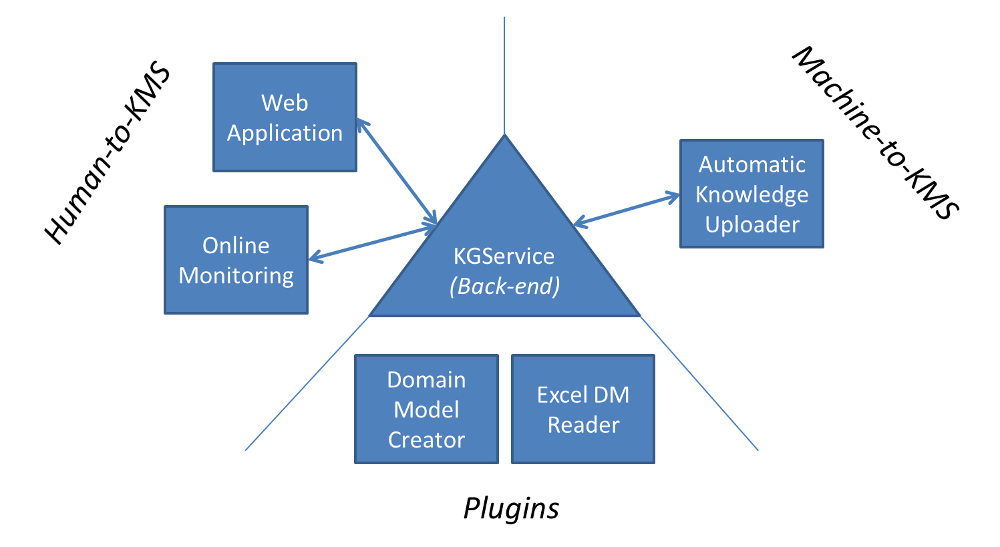

This is the entry repository to the SIMUTOOL Knowledge Management Suite (KMS) of software published under the [simutool github organization](https://github.com/simutool). It includes:
- A high-level overview of the project (in a nutshell, the science, the architecture, project background), and
- a simple *Infrastructure as Code* unit using native Docker that can help you deploy the complete back-end of the suite in a short time and with minimal effort.

## In a nutshell

- This is a data management tool. 
- Intended to be useful on an *organization-wide scale* and a cross-organizational scale.
- The origanization-wide data management problem is also a knowledge management problem (at least to us). Hence what we do can be thought of as both:
    -  Data-centric knowledge management
    -  Knowledge-centric data management
- We only have two primitives:
    - A *dataset* (structured *logical unit* of data)
    - A *document* (unstructured *logical unit* of data)

- *We achieve our goal in two steps:*
    -  Propose a simple language to *talk about* (*describe*) datasets and documents (i.e. semantic metadata model)**
    -  Embedd these descriptions within a larger organizational 'knowledge base' context (which is itself a *description* of relevant activities, agents, resources)

This is a work in progress (meaning its vision has not been completely implemented yet).

## The Science

The goal of this project is to propose a system design for *facilitating knowledge transfer across the different activities of digital manufacturing* and other similar domains. The work is divided into two parts: a  **(meta)data model** and a **Knowledge Management process**.

*  **The (Metadata) Model**: *A thin semantic graph model + a domain model that drives various parts of the system*. We start with a basic (property) graph database model; nodes with simple properties and named relations across nodes. We then develop a software component to create a thin semantic layer of types and subtypes, and controlled vocabularies to our original model. Since we built it we add other minor functionalities to model that we see as useful. We also develop a domain model to go along with the system.
*  **The Process**: A system design for the *capture*, *creation*, *sharing*, *dissemination*, *acquiring*, and *application* of (meta)data in the above model.

Its motivating domain was that of [digital manufacturing](https://cordis.europa.eu/project/rcn/198371), where many types of digital resources (sensor data, simulation data, CAD/CAM etc.) and information about them is being produced and consumed on a day to day basis. But we have done our best to make it generic enough to work on [other](https://www.uni-bamberg.de/en/mobi/research/futureiot/), [domains](https://www.uni-bamberg.de/mobi/forschung/living-lab-bamberg/informationen-zur-datenerhebung/).

## The Architechure

## Project Background

This project serves as the core of the Knolwedge Management System designed and developed for the [SIMUTOOL EC Project](https://cordis.europa.eu/project/rcn/198371). It was developed by the [Chair of Mobile Software Systems (MOBI)](https://www.uni-bamberg.de/en/mobi/) in the [University of Bamberg](https://www.uni-bamberg.de). 

This project is the result of the labour of many people under a common goal:

* Daniela Nicklas - *Lead*
* Nasr Kasrin - *Product Owner | Software Architecture*
* Adrian Lengenfelder - *Development | Devops*
* Maliha Qureshi - *Product owner of the first iteration of the semantic web side of the Project*
* Simon Steuer - *Product owner of the first iteration of the Online Monitoring Tool*
* Valentyna Voronova - *Development*
* Lukas Genßler - *Development*
* Katharina Broswik - *Web UI Development | Usability*
* Harshit Gupta - *Development on an early prototype of the Automated File Uploader and others*
